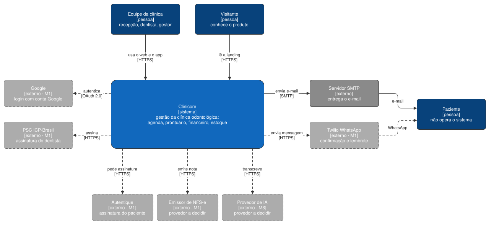

# Arquitetura

O mapa do sistema: o que existe, como as partes conversam e qual marco constrói cada uma. Segue as
seções do arc42 e desenha com o modelo C4. As regras que se conferem no código — que camada importa
qual, onde nasce cada arquivo — moram no [`AGENTS.md`](../../AGENTS.md) da raiz e no de cada app.

No texto e nos diagramas, o que já existe aparece em linha contínua, e o que ainda vai ser construído
aparece tracejado, com o marco (`M1`, `M2`, `M3`) de
[`requirements/`](../requirements/README.md#marcos).

## Objetivo

O Clinicore cobre a clínica odontológica de ponta a ponta — agenda, prontuário clínico e estético,
financeiro, estoque e laboratório — num sistema multi-tenant, usado no navegador e num app nativo que
funciona sem conexão.

As metas de qualidade que mais pesam na arquitetura:

| Meta | Requisito | O que ela impõe |
| --- | --- | --- |
| Isolamento entre clientes | [NFR-SEC-01](../requirements/non-functional/security.md) | todo dado de clínica pertence a um cliente, e a API nunca cruza dois |
| Operação offline no app | [NFR-REL-02](../requirements/non-functional/reliability.md), [NFR-REL-03](../requirements/non-functional/reliability.md) | banco local cifrado, fila de escrita e recusa de conflito na API |
| Web e app com as mesmas telas | [NFR-FLEX-01](../requirements/non-functional/flexibility.md) | uma API só, com dois clientes de transporte diferente |
| Resposta da API em até 500 ms no p95 | [NFR-PERF-01](../requirements/non-functional/performance.md) | concorrência resolvida no Postgres, sem retry na aplicação |

## Restrições

Estão em [`requirements/overview.md`](../requirements/overview.md#restrições).

## Contexto

| Ator ou sistema | O que flui | Marco |
| --- | --- | --- |
| Equipe da clínica | usa o sistema web e o app nativo | M1 |
| Visitante | lê a landing pública | existe como scaffold; conteúdo no M3 |
| Paciente | recebe e-mail e WhatsApp; nunca opera o sistema | — |
| Servidor SMTP | a API entrega o e-mail de confirmação por SMTP com STARTTLS | existe |
| Google | login com conta Google, por OpenID Connect com PKCE; a API troca o código e confere o `id_token` | a API existe para o web; o app no M1 · #94 |
| Twilio WhatsApp | confirmação e lembrete de consulta; o agente de atendimento no M3 | M1 |
| PSC ICP-Brasil | assinatura qualificada com o certificado em nuvem do dentista | M1 · [ADR 0013](../decisions/0013-assinatura-digital-em-duas-camadas.md) |
| Autentique | assinatura eletrônica avançada do paciente | M1 · [ADR 0013](../decisions/0013-assinatura-digital-em-duas-camadas.md) |
| Emissor de NFS-e | emissão da nota fiscal de serviço; provedor a decidir | M1 |
| Provedor de IA | transcrição da consulta e agente de atendimento; provedor a decidir | M3 |

## Estratégia de solução

| Decisão | Onde está |
| --- | --- |
| Quatro apps independentes, com o contrato HTTP como única fronteira | [`AGENTS.md`](../../AGENTS.md) → Stack |
| API em Rust, com axum e sqlx, e as consultas conferidas contra o schema na compilação | [ADR 0009](../decisions/0009-api-em-rust-com-axum-e-sqlx.md) |
| Um crate por processo ou capacidade | [ADR 0010](../decisions/0010-api-rs-com-crate-por-processo.md) |
| REST por recurso e todo erro em Problem Details | [ADR 0006](../decisions/0006-api-rest-e-problem-details.md) |
| O documento OpenAPI nasce com a rota | [ADR 0011](../decisions/0011-openapi-da-api-rs-nasce-com-a-rota.md) |
| Sistema web como SPA em Vite, separado da landing | [ADR 0002](../decisions/0002-web-e-site-em-vite.md) |
| Landing em Next.js standalone | [ADR 0008](../decisions/0008-site-em-next-standalone.md) |
| App nativo em Flutter, com offline completo | [ADR 0007](../decisions/0007-app-nativo-em-flutter-com-offline.md) |
| Revogação de sessão escrita no Redis antes de apagar no Postgres | [ADR 0012](../decisions/0012-revogacao-de-sessao-antes-de-apagar.md) |
| Assinatura digital por provedor existente, em duas camadas | [ADR 0013](../decisions/0013-assinatura-digital-em-duas-camadas.md) |

## Conteúdo

| Seção do arc42 | Onde |
| --- | --- |
| 5. Blocos de construção | [`building-blocks/`](building-blocks/README.md) |
| 6. Visão de runtime | [`runtime/`](runtime/README.md) |
| 7. Visão de implantação | [`deployment.md`](deployment.md) |
| 8. Conceitos transversais | [`concepts/`](concepts/README.md) |
| 9. Decisões de arquitetura | [`../decisions/`](../decisions/README.md) |
| 10. Requisitos de qualidade | [`../requirements/`](../requirements/README.md#requisitos), nos `NFR-` |
| 11. Riscos e dívida técnica | [`risks.md`](risks.md) |
| 12. Glossário | [`../requirements/glossary.md`](../requirements/glossary.md) |
