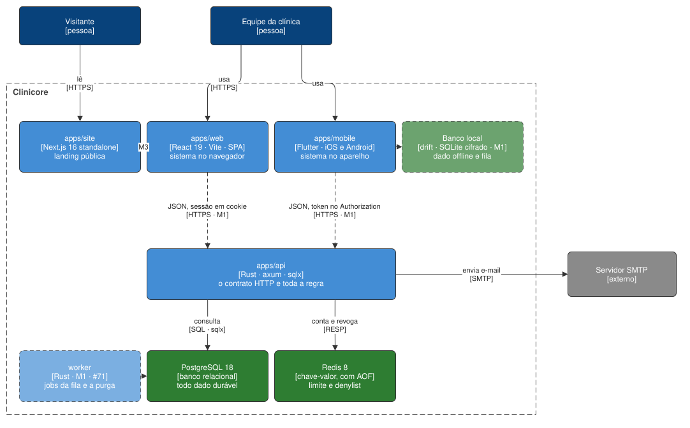

# Blocos de construção

O sistema decomposto em processos e armazenamentos. Cada bloco tem o próprio arquivo, com o que ele
faz, o que ele nunca faz e o que é preciso saber para mudá-lo.

| Bloco | Tecnologia | Responsabilidade | Fala com | Marco | Arquivo |
| --- | --- | --- | --- | --- | --- |
| `apps/api` | Rust · axum · sqlx | o contrato HTTP e toda a regra de negócio | PostgreSQL (SQL), Redis (RESP), SMTP | existe: cadastro, confirmação de e-mail e sessão; os módulos de produto no M1 | [api.md](api.md) |
| `apps/web` | React 19 · Vite · TanStack | o sistema da clínica no navegador | `apps/api` (HTTPS, JSON, sessão em cookie) | existe como scaffold; telas no M1 | [web.md](web.md) |
| `apps/mobile` | Flutter | o sistema da clínica no aparelho, com offline | `apps/api` (HTTPS, JSON, token no `Authorization`) | existe como scaffold; telas e offline no M1 | [mobile.md](mobile.md) |
| `apps/site` | Next.js 16 standalone | a landing pública e indexável | ninguém hoje; o `apps/web` por link no M3 | existe como scaffold; conteúdo no M3 | [site.md](site.md) |
| PostgreSQL 18 | banco relacional | todo dado durável | — | existe | [postgres.md](postgres.md) |
| Redis 8 | chave-valor com AOF | contagem do limite de requisições e denylist de sessão | — | existe | [redis.md](redis.md) |
| worker | Rust, em `apps/api/crates/worker/` | os jobs da fila e a purga do que venceu | PostgreSQL | M1 · #71 | sem arquivo até existir |
| Banco local do app | drift sobre SQLite cifrado | o dado offline e a fila de escrita | — | M1 · [ADR 0007](../../decisions/0007-app-nativo-em-flutter-com-offline.md) | descrito em [mobile.md](mobile.md) |
