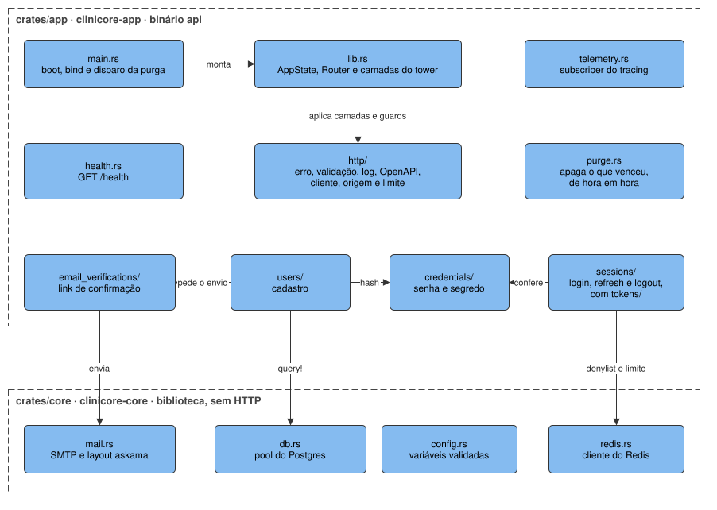

# `apps/api`

A API HTTP que o web e o app consomem, em Rust com axum e sqlx. É o único bloco que fala com o
PostgreSQL e com o Redis, e é onde mora toda a regra de negócio.

**Nunca faz:** servir tela, guardar estado em memória entre requisições, montar SQL por concatenação.

## Blocos internos

| Bloco | Onde | Responsabilidade |
| --- | --- | --- |
| Boot | `crates/app/src/main.rs` | lê a configuração, liga o `tracing`, faz o bind e dispara a purga |
| Router | `crates/app/src/lib.rs` | o `AppState`, as rotas e as camadas do tower: log, CORS, panic, IP do cliente e limite de corpo |
| Encanamento HTTP | `crates/app/src/http/` | erro em Problem Details, extractor de validação, log de requisição, OpenAPI, guards de cliente e de origem, limite de requisições |
| `health` | `crates/app/src/health.rs` | `GET /health` |
| `users` | `crates/app/src/users/` | o cadastro, em `POST /users` |
| `email_verifications` | `crates/app/src/email_verifications/` | o envio e a confirmação do link de e-mail |
| `sessions` | `crates/app/src/sessions/` | login, leitura da sessão, refresh e logout, com os tokens em `tokens/` |
| `oauth` | `crates/app/src/oauth/` | o login com Google por OpenID Connect com PKCE, com o `id_token` conferido, e o vínculo com a conta do mesmo e-mail |
| `credentials` | `crates/app/src/credentials/` | hash de senha em Argon2 e segredo aleatório, usados por várias features |
| Purga | `crates/app/src/purge.rs` | apaga, de hora em hora, sessão, verificação e registro de envio vencidos |
| Telemetria | `crates/app/src/telemetry.rs` | o subscriber do `tracing` |
| `core` | `crates/core/` | configuração, pool do Postgres, cliente do Redis e e-mail; biblioteca que não conhece HTTP |

As features de produto — pacientes, agenda, prontuário, financeiro, estoque, laboratório — entram como
pastas novas em `crates/app/src/`, no M1.

## Rotas que existem

| Método e caminho | O que faz |
| --- | --- |
| `GET /health` | responde que o processo está de pé |
| `POST /users` | cria a conta com e-mail e senha |
| `POST /email-verifications` | envia um novo link de confirmação |
| `POST /email-verifications/confirmation` | confirma o e-mail com o token do link |
| `POST /sessions` | entra com e-mail e senha |
| `GET /sessions/current` | lê o usuário da sessão |
| `DELETE /sessions/current` | sai e revoga a sessão |
| `POST /sessions/current/tokens` | rotaciona o refresh token |
| `GET /oauth/google` | redireciona o navegador para o login do Google |
| `GET /oauth/google/callback` | recebe a volta do Google, vincula ou cria a conta e abre a sessão web |

Fora de produção, o documento OpenAPI fica em `/api-json` e a interface dele em `/api`.

## Para mudar com segurança

As camadas, a ordem dos guards, as regras de SQL, de erro e de teste estão no
[`apps/api/AGENTS.md`](../../../apps/api/AGENTS.md). O que o cliente observa — URL, status, cookies,
limites e o formato do erro — é contrato, e toda rota nova chega ao app por regeração do cliente
([mobile.md](mobile.md)).
