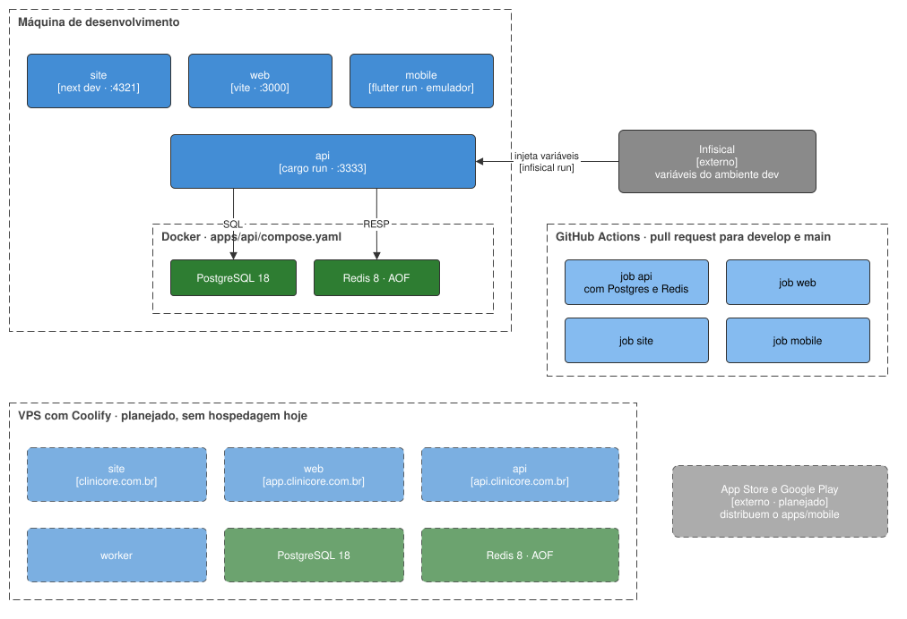

# Implantação

Onde cada bloco roda, em cada ambiente, e como ele chega lá.

## Ambientes

| Ambiente | Estado | Onde roda |
| --- | --- | --- |
| Desenvolvimento | existe | a máquina de quem desenvolve |
| CI | existe | GitHub Actions |
| Homolog (`develop`) | planejado | a VPS com Coolify |
| Produção (`main`) | planejado | a VPS com Coolify |

**Não há hospedagem hoje.** Nenhum app tem Dockerfile, e o `compose.yaml` da raiz, com a stack inteira,
nasce com o deploy.

## Desenvolvimento

| Bloco | Como roda | Porta |
| --- | --- | --- |
| `apps/api` | `cargo run`, dentro do `infisical run --path=/api --` | 3333 |
| `apps/web` | `npm run dev` | 3000 |
| `apps/site` | `npm run dev` | 4321 |
| `apps/mobile` | `flutter run --dart-define-from-file=config/<ambiente>.json`, no emulador ou no aparelho | — |
| PostgreSQL 18 e Redis 8 | `docker compose up`, pelo `apps/api/compose.yaml` | as do Infisical |

As variáveis da API vêm do Infisical, no ambiente `dev`; nenhum arquivo `.env` com valor real fica no
disco. No emulador Android, a API local é `http://10.0.2.2:3333`.

## Produção e homolog — planejado

| Bloco | Endereço | Como roda |
| --- | --- | --- |
| `apps/site` | `clinicore.com.br` | container com o servidor standalone do Next.js |
| `apps/web` | `app.clinicore.com.br` | container servindo o build estático do Vite |
| `apps/api` | `api.clinicore.com.br` | container com o binário `api` |
| worker | — | container com o binário do worker, quando a #71 o criar |
| PostgreSQL 18 | rede interna | container com volume cifrado ([NFR-SEC-02](../requirements/non-functional/security.md)) |
| Redis 8 | rede interna | container com `--appendonly yes` e volume |
| `apps/mobile` | App Store e Google Play | publicado pelas lojas |

Os três domínios compartilham o domínio registrável, o que mantém o cookie de sessão em
`SameSite=Lax`. Atrás do proxy, a API lê o IP do cliente do header que só o proxy escreve, definido em
`CLIENT_IP_SOURCE`, e só pode ser alcançável por ele.

Backup e recuperação estão em aberto, na
[OQ-11](../requirements/open-questions.md#oq-11--backup-e-recuperação).

## Entrega

- **Toda entrega chega por pull request** para a `develop`; o release é um pull request da `develop`
  para a `main`.
- **O CI roda em todo pull request** para as duas, por `.github/workflows/ci.yml`, com um job por app:
  `api` (com PostgreSQL e Redis de serviço), `web`, `site` e `mobile`. Os gates de cada job são os do
  [`AGENTS.md`](../../AGENTS.md), em Comandos.
- **Não há deploy automático.** Ele nasce junto da hospedagem.
- **O build do app nativo está fora do CI** até a publicação nas lojas.
