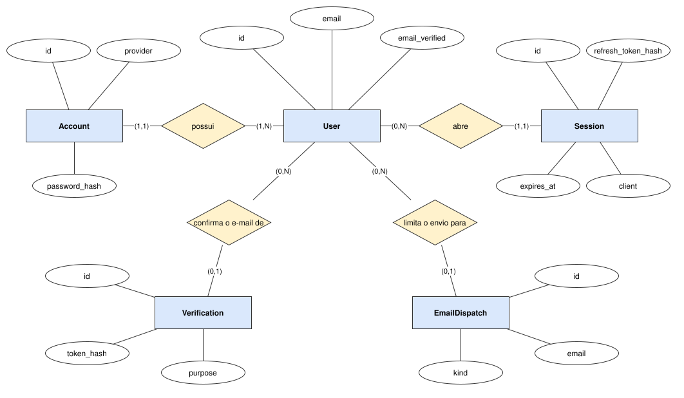

# Modelo de dados

O que o sistema guarda hoje: a conta, a sessão e a confirmação de e-mail. As entidades dos módulos de
produto — cliente, clínica, paciente, agenda, prontuário, financeiro, estoque, laboratório — entram
aqui com a spec de cada um, no M1.

## Modelo conceitual

`Verification` e `EmailDispatch` se ligam ao `User` pelo endereço de e-mail, não por chave estrangeira:
as duas existem para um endereço, e sobrevivem ao usuário até vencerem.

## Entidades

| Entidade | O que é | Marco | Arquivo |
| --- | --- | --- | --- |
| User | uma pessoa que entra no sistema | existe | [user.md](user.md) |
| Account | um jeito de essa pessoa provar quem é: senha ou Google | existe; Google no M1 · #120 | [account.md](account.md) |
| Session | um login ativo num navegador ou num aparelho | existe | [session.md](session.md) |
| Verification | um token de uso único mandado a um e-mail | existe; redefinição de senha no M1 · #119 | [verification.md](verification.md) |
| EmailDispatch | o registro de um e-mail enviado, para limitar o envio | existe | [email-dispatch.md](email-dispatch.md) |

## Conteúdo

- [Padrões de acesso](access-patterns.md) — cada operação, o que ela lê e escreve
- [Armazenamento](storage.md) — tabelas, índices e migrations
